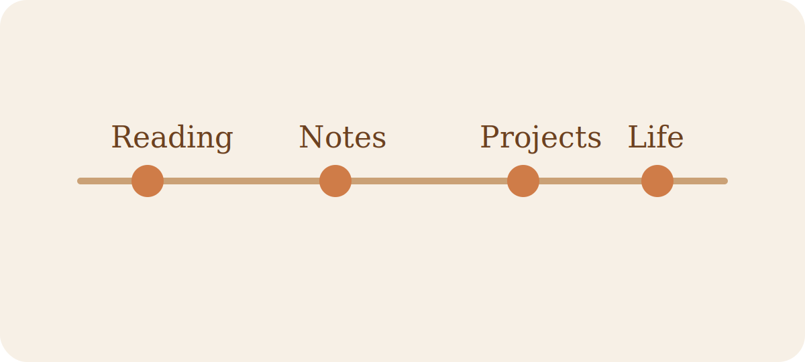

## 为什么要把内容分开写

如果所有东西都塞进同一个时间流里，文献笔记、学习笔记、项目日志和生活记录会互相打架。
分区之后，每一类内容都会有更稳定的节奏：

- `Blog` 放生活记录和完整博客文章
- `Reading` 放论文、书籍和报告的阅读卡片
- `Notes` 放学习中的整理与备忘
- `Projects` 放项目过程与复盘

### 长期写作比一次性整理更重要

我更希望这个站是“可慢慢长出来的”，而不是一次性搭完就不再更新的展示页。

## 以后会写些什么

这里会持续加入：

1. 文献阅读中对概念的拆解
2. 技术学习里的代码实验
3. 生活里值得被留下来的片段
4. 项目中反复踩过的坑和选择理由

## 一点格式测试

行内代码像 `astro build` 这样展示，代码块会有高亮：

```ts
const sections = ['blog', 'reading', 'notes', 'projects'];

const visible = sections.filter((section) => section.length > 0);

console.log(`Visible sections: ${visible.join(', ')}`);
```

如果只是短句，我也希望它看起来像是在一本纸质笔记里被认真记录过。

